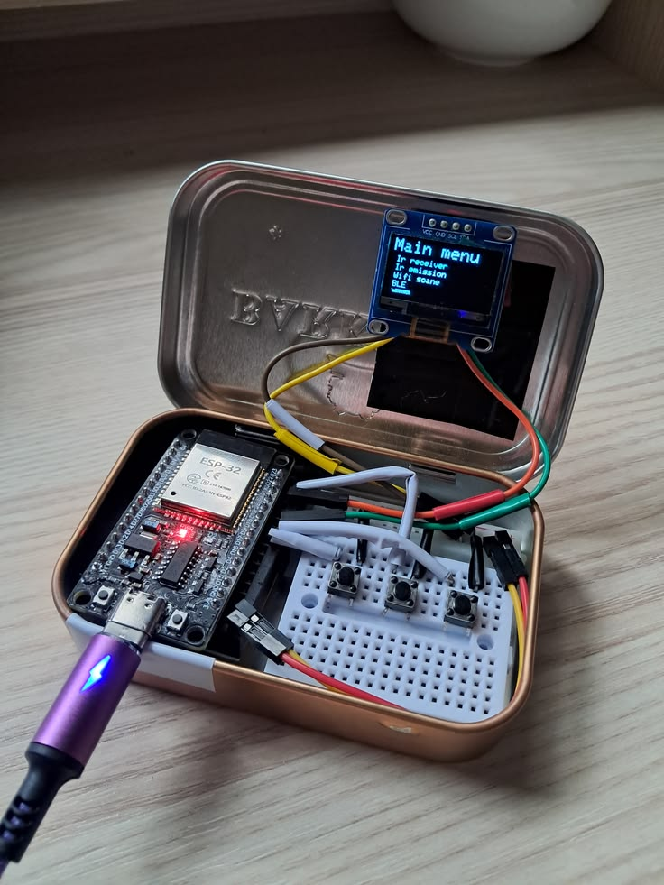
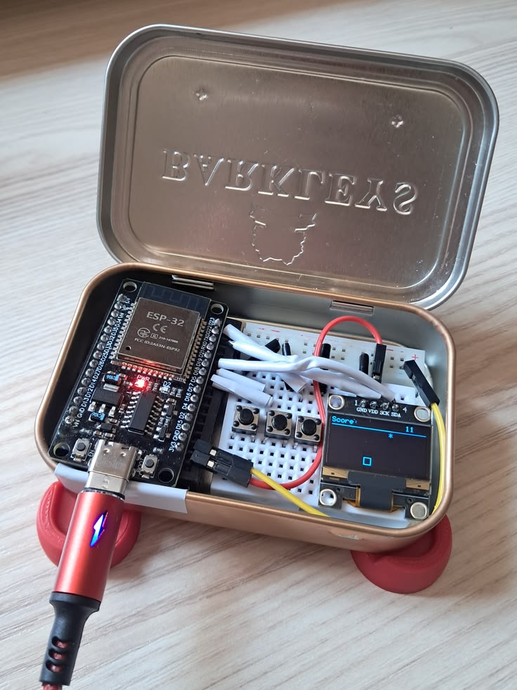

# DIY Flipper

This is a personal ESP32 project inspired by Flipper Zero.

It includes IR receiver and transmitter logic, BLE and WiFi scanning, a small game, and simple animations.

---

## First version

---

## Second version

---

## Note

For any questions, you can contact me via GitHub.